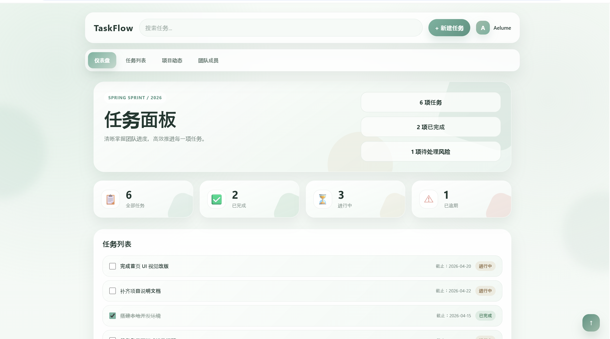
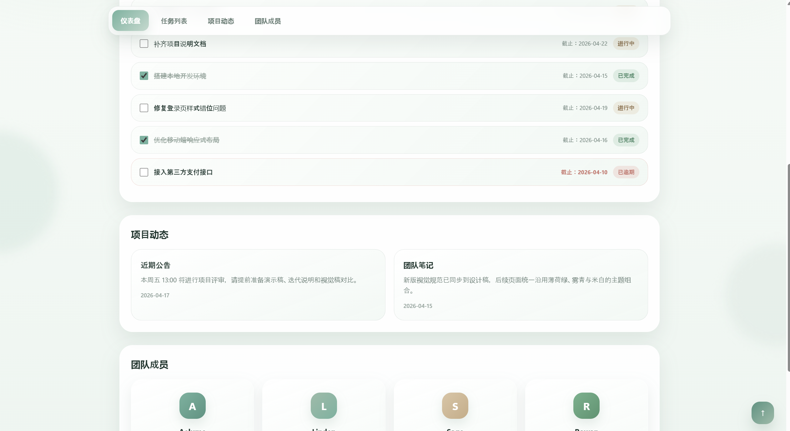
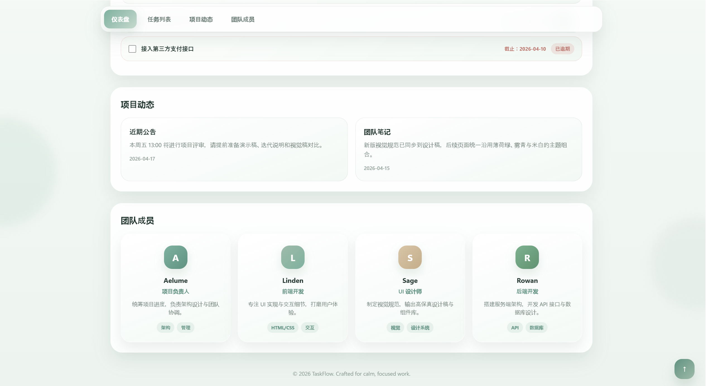
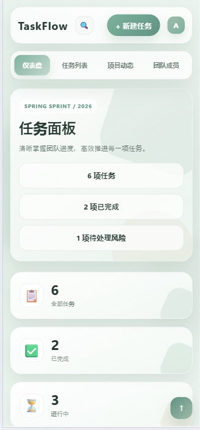
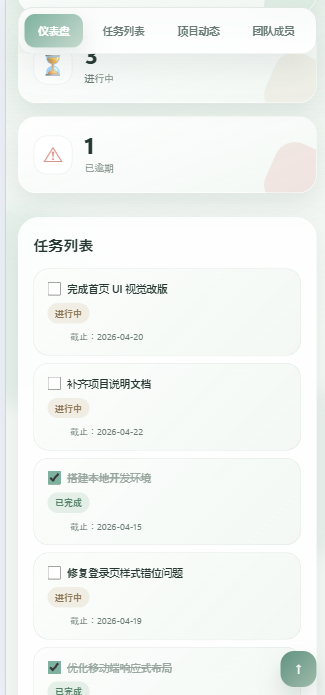
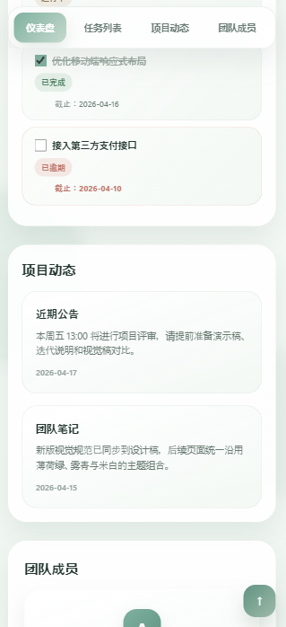
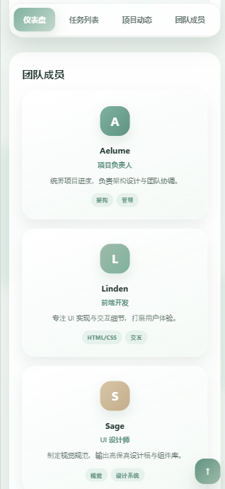

# TaskFlow 任务面板

## 项目简介

这是一个使用 HTML + CSS 完成的任务管理页面。

## 页面包含的内容

- **顶部区域**：Logo、搜索栏、新建任务按钮、用户头像
- **导航区域**：仪表盘、任务列表、项目动态、团队成员四个锚点导航
- **数据卡片区**：展示全部任务、已完成、进行中、已逾期四项统计
- **任务列表区**：包含 6 条任务，带勾选框、截止日期和状态标签
- **附加信息模块**：近期公告和团队笔记两张信息卡片
- **团队成员模块**：展示四位团队成员的头像、角色与技能标签

## 我是怎么实现的

### HTML 结构

我把页面分成了这几个部分：

- `header`：顶部操作栏，包含 Logo、搜索框、新建按钮和用户信息
- `nav`：粘性导航栏，用锚点链接跳转到各个板块
- `main`：主体内容区域，内部包含四个 `section`：
  - `section#dashboard`：仪表盘，包括 Hero 横幅和四张统计卡片
  - `section#tasks`：任务列表，用 `ul > li` 组织每条任务
  - `section#info`：项目动态，用 `article` 包裹每张信息卡片
  - `section#team`：团队成员，用 `article` 包裹每张成员卡片
- `footer`：页脚版权信息

### CSS 布局

我主要使用了：

- **flex**：用于顶部操作栏的横向排列、导航标签的横向排列、每条任务行内的元素对齐、团队成员卡片内部的纵向居中排列
- **grid**：用于仪表盘四张统计卡片的四列网格、信息卡片的两列网格、团队成员卡片的四列网格

### 响应式处理

当屏幕变小时，我做了这些调整：

- `980px` 以下：Hero 横幅改为单列，统计卡片和团队成员卡片从四列变为两列
- `720px` 以下：桌面搜索框隐藏，改用移动端搜索按钮切换；导航栏支持横向滚动；用户名隐藏只显示头像
- `520px` 以下：统计卡片、信息卡片和团队成员卡片全部改为单列；任务列表行内元素自动换行

## 页面截图

### 桌面端

### 移动端

注： 为了适配移动端的屏幕  把内容竖着展开可以滚动查看，同时让搜索框变成一个图标点击可以展开，这样既在移动端保留了搜素功能 ，同时也适配了小屏幕空间有限的特点。
